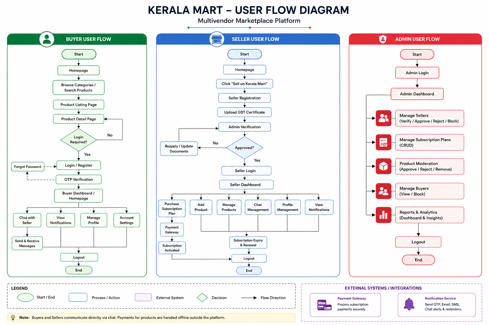
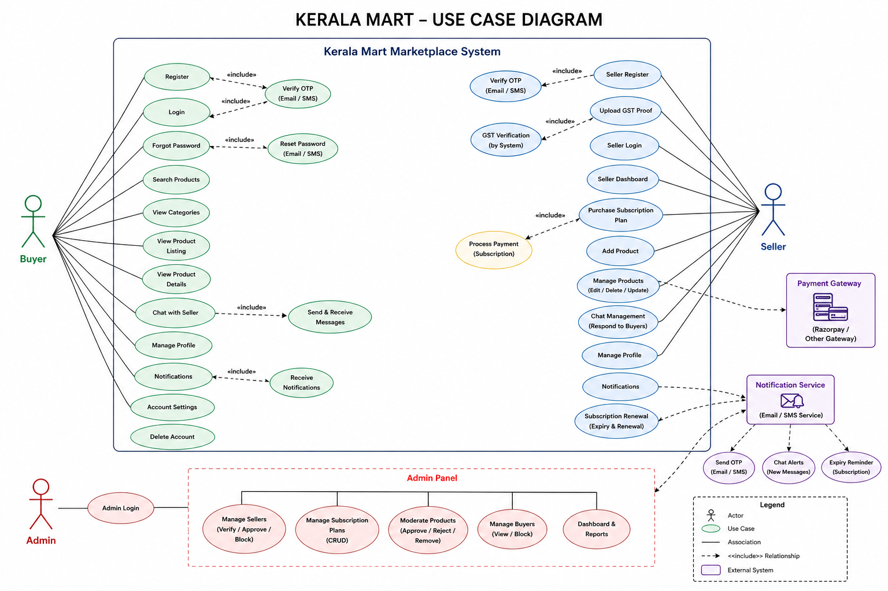

# Kerala Mart – Business Analysis Documentation

## 📌 Project Overview
Kerala Mart is a multivendor marketplace platform designed to connect buyers and verified sellers through a product listing and direct communication system.

This repository contains complete Business Analysis documentation prepared as part of an internship project, including Software Requirements Specification (SRS), user stories, workflows, and system analysis.

---

## 📄 Project Documents
- Software Requirements Specification (SRS)
- User Flow Diagram
- Use Case Diagram
- Functional Requirements
- Non-Functional Requirements
- User Stories & Acceptance Criteria
- Admin Module Documentation

---

## 🎯 Key Features
- Buyer & Seller Registration
- GST Verification System
- Product Listing Management
- Subscription-Based Seller Access
- Direct Buyer-Seller Chat
- Product Search & Filtering
- Admin Moderation Dashboard
- Notifications & Profile Management

---

## 🛠️ Business Analysis Activities
- Requirement Gathering
- Requirement Documentation
- User Story Writing
- Workflow Analysis
- Use Case Modelling
- Functional Requirement Analysis
- System Behaviour Documentation

---

## 📊 Diagrams

### User Flow Diagram

### Use Case Diagram

---

## 📚 Documentation
The complete SRS document is available in the `SRS` folder.

---

## 👨‍💻 Author
Mohammed Jasim

### Skills Demonstrated
- Business Analysis
- Requirement Engineering
- SRS Documentation
- UML Use Case Diagrams
- User Flow Analysis
- Functional Documentation

---

## 📌 Disclaimer
This project was created for educational and portfolio purposes as part of internship-based Business Analysis practice.
